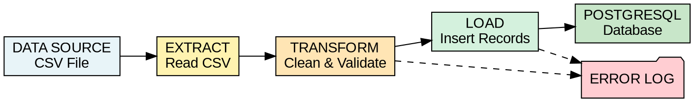

# 📊 Diagram a Simple ETL Pipeline (No Execution)

<div align="center">

# 🚀 ETL Pipeline Design 

### Design • Document • Visualize • Validate


</div>

---

# 📖 Overview

ETL (Extract, Transform, Load) pipelines are fundamental components of modern Data Engineering.

Before implementing a pipeline, engineers first design and document the architecture to ensure:

✅ Scalability

✅ Data Quality

✅ Error Handling

✅ Business Rule Compliance

✅ Stakeholder Communication

In this lab, you will design an ETL pipeline that processes customer order data from CSV files and loads the transformed data into a PostgreSQL database.

---

# 🎯 Learning Objectives

By the end of this lab, you will be able to:

### 📥 Extract
- Identify data sources
- Understand source file structures
- Document extraction requirements

### 🔄 Transform
- Define validation rules
- Specify data cleaning processes
- Design enrichment logic

### 📤 Load
- Design database targets
- Define loading strategies
- Plan error handling

### 📊 Visualize
- Create ETL architecture diagrams
- Document data flow
- Build technical design documentation

---

# 📚 Prerequisites

Before starting this lab, ensure you have:

- 🐧 Basic Linux knowledge
- 📝 Experience using text editors
- 🗄️ Understanding of databases
- 📊 Familiarity with data concepts
- 📂 Knowledge of data sources and destinations

---

# 🏗️ Scenario

An e-commerce company receives daily customer order files in CSV format.

The company requires a pipeline that:

1. Extracts order data
2. Cleans and validates records
3. Enriches data with calculated values
4. Loads results into PostgreSQL
5. Logs invalid records

---

# ⚙️ Environment Setup

## 🔧 Update Packages

```bash
sudo apt update
```

---

## 📦 Install Graphviz

```bash
sudo apt install -y graphviz
```

---

## 📝 Install Nano

```bash
sudo apt install -y nano
```

---

## 📁 Create Workspace

```bash
mkdir -p ~/etl-lab

cd ~/etl-lab
```

---

# 🧩 Task 1: Identify Pipeline Components

---

## 📝 Step 1: Create Documentation File

```bash
nano pipeline_components.txt
```

---

## 📥 Step 2: Document Data Source

```text
=== ETL PIPELINE COMPONENTS ===

1. DATA SOURCE (EXTRACT)

Type: CSV File

Name: daily_orders.csv

Location: /data/incoming/

Format: Comma-separated values

Columns:
- order_id
- customer_id
- product_id
- quantity
- price
- order_date

Update Frequency:
Daily at 2:00 AM

File Size:
~50MB

Sample Data:

order_id,customer_id,product_id,quantity,price,order_date
1001,C001,P501,2,29.99,2024-01-15
1002,C002,P502,1,49.99,2024-01-15
```

---

## 🔄 Step 3: Define Transformation Layer

```text
2. TRANSFORMATION LAYER (TRANSFORM)

Data Cleaning:
- Remove duplicate order_id
- Handle missing customer_id
- Validate price > 0
- Validate quantity > 0

Data Enrichment:
- Calculate total_amount
- Standardize date format
- Add processing timestamp

Validation:
- Unique order_id
- Customer format check
- Product format check

Business Rules:
- Flag orders > $1000
- Reject invalid dates
```

---

## 🗄️ Step 4: Define Target Database

```text
3. TARGET DATABASE (LOAD)

Database:
PostgreSQL

Database Name:
ecommerce_db

Schema:
orders

Table:
processed_orders

Columns:
- order_id
- customer_id
- product_id
- quantity
- price
- total_amount
- order_date
- processing_timestamp
- high_value_flag

Load Strategy:
Append Daily

Error Handling:
Log failed records
```

---

# 🎨 Task 2: Create Architecture Diagram

---

## 📝 Step 1: Create DOT File

```bash
nano etl_pipeline.dot
```

---

## 📊 Step 2: Add Diagram Definition



---

## 🖼️ Step 3: Generate Diagram Files

### PNG

```bash
dot -Tpng etl_pipeline.dot -o etl_pipeline.png
```

### SVG

```bash
dot -Tsvg etl_pipeline.dot -o etl_pipeline.svg
```

### PDF

```bash
dot -Tpdf etl_pipeline.dot -o etl_pipeline.pdf
```

---

## 👀 Step 4: Verify Generated Files

```bash
ls -lh etl_pipeline.*
```

Expected:

```text
etl_pipeline.dot
etl_pipeline.png
etl_pipeline.svg
etl_pipeline.pdf
```

---

# 📖 Task 3: Document Data Flow

---

## 📝 Create Documentation File

```bash
nano data_flow_explanation.txt
```

---

## 🔄 ETL Flow Sequence

### 1️⃣ Source → Extract

- CSV arrives daily
- Stored in /data/incoming/
- Contains raw order data
- 10,000–50,000 records

---

### 2️⃣ Extract → Transform

- Read file
- Parse CSV
- Validate structure
- Pass raw data

---

### 3️⃣ Transform → Load

- Remove duplicates
- Apply validation
- Calculate totals
- Add timestamps
- Prepare clean records

---

### 4️⃣ Transform → Error Log

- Missing values
- Invalid IDs
- Business rule failures

---

### 5️⃣ Load → PostgreSQL

- Connect to database
- Insert records
- Commit transaction
- Log success

---

### 6️⃣ Load → Error Log

- Connection issues
- Constraint violations
- Duplicate keys

---

# 🔍 Data Transformations

### Input

```text
order_id
customer_id
product_id
quantity
price
order_date
```

### Output

```text
order_id
customer_id
product_id
quantity
price
order_date
total_amount
processing_timestamp
high_value_flag
```

---

# ✅ Quality Checks

### Duplicate Detection

```text
order_id must be unique
```

### Validation Rules

```text
customer_id format
product_id format
positive quantity
positive price
```

### Business Rules

```text
Flag orders > $1000
```

### Completeness

```text
No NULL values
```

---

# 🚨 Error Handling Strategy

### Validation Errors

```text
Log with reason code
```

### Load Failures

```text
Retry 3 times
```

### Critical Failures

```text
Notify Operations Team
```

---

# 🧪 Verification Steps

---

## ✅ Verify Components

```bash
cat pipeline_components.txt | grep -E "DATA SOURCE|TRANSFORMATION|TARGET"
```

Expected:

```text
DATA SOURCE
TRANSFORMATION
TARGET
```

---

## ✅ Verify Diagram Files

```bash
ls -lh etl_pipeline.*
```

---

## ✅ Verify Data Flow Documentation

```bash
wc -l data_flow_explanation.txt
```

Expected:

```text
50+ lines
```

---

## ✅ Validate DOT Syntax

```bash
dot -v etl_pipeline.dot 2>&1 | grep -i error
```

Expected:

```text
No output
```

---

# 📋 Generate Summary Report

```bash
cat > lab_summary.txt << 'EOF'

ETL PIPELINE DESIGN LAB - COMPLETION SUMMARY

Components:
- Data Source
- Transformation Layer
- Target Database

Diagram:
- Visual ETL Architecture
- Error Handling Paths
- Multiple Output Formats

Documentation:
- Data Flow
- Validation Rules
- Business Logic

EOF

cat lab_summary.txt
```

---

# 🛠️ Troubleshooting

## ❌ Graphviz Not Found

```bash
which dot
```

Install:

```bash
sudo apt install -y graphviz
```

---

## ❌ Cannot Open PNG

Verify file type:

```bash
file etl_pipeline.png
```

Expected:

```text
PNG image data
```

---

## ❌ DOT Syntax Error

Validate:

```bash
dot -v etl_pipeline.dot
```

Check for:

- Missing semicolons
- Missing braces
- Incorrect labels

---

# 🏆 Lab Deliverables

At the end of this lab you should have:

📄 pipeline_components.txt

📄 etl_pipeline.dot

🖼️ etl_pipeline.png

🖼️ etl_pipeline.svg

📄 etl_pipeline.pdf

📄 data_flow_explanation.txt

📄 lab_summary.txt

---

# 🎓 Conclusion

You have successfully designed a complete ETL pipeline without writing production code.

### Skills Acquired

✅ ETL Architecture Design

✅ Data Flow Documentation

✅ Transformation Planning

✅ Error Handling Design

✅ Diagram Creation using Graphviz

✅ Data Engineering Best Practices

---

# 💡 Key Takeaway

> Great Data Engineers design before they build.

A well-designed ETL pipeline reduces implementation risks, improves data quality, simplifies maintenance, and provides a clear blueprint for future development.

---

<div align="center">

## 🚀 Next Step

Build this ETL Pipeline using:

🐍 Python

⚡ Apache Airflow

🐘 PostgreSQL

📊 Data Engineering Best Practices

⭐ Happy Learning!

</div>
